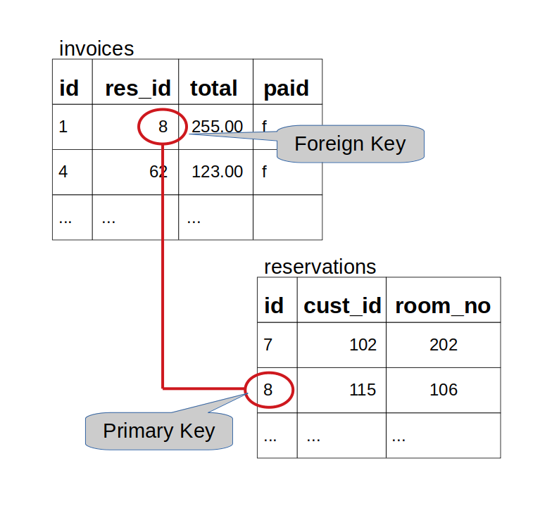

# Database 2: More SQL and integration with NodeJS

---

**Teaching this lesson?**

Read the Mentors Notes [here](./mentors.md)

---

## What will we learn today?

- Revision from last week
- [More SQL](#more-sql)
  - Using aggregate functions in a query
  - Updating a row
  - Deleting a row
  - Joining tables
  - Other useful operations
- [Integration with NodeJS](#integration-with-nodejs)
  - Introduction to node-postgres
  - Loading data from a database with a GET endpoint
- [Homework](#homework)

---

## Learning Objectives

- Aggregate data over multiple rows and use aggregate values to restrict the results
- Update rows in a pre-existing table using PostgreSQL using `UPDATE`
- Delete unwanted rows from an existing table using `DELETE`
- Combine tables together in PostgreSQL using `INNER JOIN`
- Connect a PostgreSQL database to a NodeJS application
- Retrieve data from a PostgreSQL database in a NodeJS application

---

### Using Aggregate Functions

How to calculate totals, averages, etc. over multiple rows.

You frequently need to get a single piece of information that is derived from multiple rows in a table. For example, when you need to know the total i

```sql
    SELECT sum(total)
       FROM invoices
       WHERE invoice_date BETWEEN
             '2018-08-01' AND '2018-08-31';
```

The aggregate functions are:
*   sum :   Calculate the total of the values in a column
*   avg :   Calculate the average (mean) of the values in a column
*   min :   Determine the mimimum value of a column
*   max :   Determine the maximum value of a column
*   count : Count the number of values (non-null) in a column

All the above are in the SQL standard, most implementations provide others. SUM and AVG can only apply to numeric data, the others can apply to any datatype.

Further examples:

"What is the average length of stay at our hotel?" :

```sql
    SELECT avg(checkout_date - checkin_date)
       FROM reservations;
```

"What are the lowest and highest room rates we charge?" :

```sql
    SELECT min(rate) AS lowest,
           max(rate) AS highest
       FROM rooms;
```

You can use the count(x) function to count non-null values:

```sql
    SELECT count(id) AS id_ct, count(postcode) AS post_ct
        FROM customers;
     id_ct | post_ct
    -------+---------
       133 |     126
    (1 row)
```

Notice that these two results show different values - there are NULL values for postcode but id is mandatory for all rows.

If you just want to count the number of rows, use `count(*)`:

```sql
    SELECT count(*) FROM customers;
```

### Grouping Rows for Aggregation
You can calculate aggregates over subsets of rows using the GROUP BY clause:

```sql
    SELECT count(*) FROM rooms
       GROUP BY room_type;
     count
    -------
        14
        14
        8
        10
        2
    (5 rows)
```

What do you notice?

The query calculated the counts correctly but we have no idea which room type each value represents. To solve this we are allowed to include the GROUP BY expressions in the list of selected values, as below:

```sql
    SELECT room_type, count(*) FROM rooms
       GROUP BY room_type;
     room_type    | count
    --------------+-------
     PREMIUM      |    14
     PREMIER      |    14
     PREMIER PLUS |     8
     PREMIUM PLUS |    10
     FAMILY       |     2
    (5 rows)
```

Notice the `room_type` used for GROUP BY is also included in the SELECT list of values.

We can group by multiple expressions, for example:

```sql
    SELECT trunc(room_no/100) AS floor,
        to_char(checkin_date, 'YYYY-MM') AS month,
        count(*), sum(no_guests), avg(no_guests)
    FROM reservations
    GROUP BY floor, month;
```

Notice that the GROUP BY is using the column aliases `floor` and `month` that have been defined in the select list. This works in many, but not all, SQL implementations. (In those that don't allow aliases you must use the full expression, for example: `trunc(room_no/100)` instead of `floor`)

You can use a WHERE clause to restrict the rows that are included in the aggregate function. For example, if we need the above query for only the 2nd and 3rd floors:

```sql
    SELECT trunc(room_no/100) AS floor,
           to_char(checkin_date, 'YYYY-MM') AS month,
           count(*), sum(no_guests), avg(no_guests)
       FROM reservations
       WHERE room_no BETWEEN 200 AND 399
       GROUP BY floor, month;
```

Note that it is NOT usually possible to use column aliases in the where condition.

A WHERE clause is applied before any aggregation, if you need to restrict results using an aggregate function you can't do that using the WHERE clause.

In the above, to return only results with the number of reservations greater than, say, 4 we use the HAVING clause:

```sql
    SELECT trunc(room_no/100) AS floor,
           to_char(checkin_date, 'YYYY-MM') AS month,
           count(*), sum(no_guests), avg(no_guests)
       FROM reservations
       GROUP BY floor, month
       HAVING count(*) > 4;    --<< Note the HAVING keyword
```

The order of clauses in the SELECT statement is:

```sql
    SELECT ...
       FROM ...
       [WHERE ...]
       [GROUP BY ...
       [HAVING ...] ]
       [ORDER BY ...]
```

The square brackets indicate optional clauses. Note that HAVING is only relevant when you have a GROUP BY and must follow it in the SELECT statement.

It can be confusing at first knowing whether to use a WHERE clause or a HAVING clause with GROUP BY.

Use the WHERE clause when values you want to test are available without having to use any aggregate functions (e.g. plain column values).

Use HAVING when the values you want to test are the results of aggregate functions (e.g. `count(*)`, `sum(amount)`, `min(x)`, etc...).

---
### Exercise
1.  Get the numbers of rows in each of the tables: rooms, room_types, customers and reservations.
2.  How many reservations do we have for next month?
3.  Which rooms have been occupied for less than 10 nights and for how many nights have they been occupied?
4.  How many invoices are still unpaid from over a month ago and what is the total owed?
---

### Updating a row

The general construction to update a row is:

```sql
UPDATE table
  SET column1 = value1,
      column2 = value2
  WHERE condition;
```

For example, to update the name and country of the customer with ID 3:

```sql
UPDATE customers
  SET name='Bob Marley',
      country='Jamaica'
  WHERE id=3;
```

#### Exercise 3

- Update the postcode of the customer named `Alice Evans` to `M21 8UP`
- Update room 107 to allow up to 3 guests
- For the customer named `Nadia Sethuraman`, update her address to `2 Blue Street`, her city to `Glasgow` and her postcode to `G12 1AB` in one query
- Update all the future bookings of customer with ID 96 to 3 nights (starting on the same check-in date) in one query

### Deleting a row

The syntax to delete a row is:

```sql
DELETE FROM table WHERE condition;
```

For example, to delete the booking with ID 4:

```sql
DELETE FROM bookings WHERE id=4;
```

**NOTE:** If you don't supply a `WHERE` clause with `DELETE` or `UPDATE` the command will be applied to **all** the rows in the table which is rarely what you want.

#### Exercise 4

- Delete the booking of customer ID `8` for the date `2020-01-03`
- Delete all the bookings of customer Juri Yoshido (hint: subquery)
- Delete the customer details for Juri Yoshido

### Joining tables

So far we've only looked at one table in any query. Many problems require data from several tables - how do we do that?

For example, if I want to phone or email customers who have not yet paid their invoices, which tables do I need to look at?

Use joins to combine data from more than one table. Joins use column values to match rows in one table to rows in another.

The join columns are usually referred to as foreign keys and primary keys.



To join reservations and invoices in SQL:

```sql
    SELECT r.cust_id, r.room_no, i.invoice_date, i.total
       FROM reservations r JOIN
            invoices i ON (r.id = i.res_id);
```

Notice:

The new keyword JOIN with ON (predicate)

Table aliases (r and i) used to qualify columns

The new syntax follows the following pattern:

```sql
    SELECT ...
      FROM ... [JOIN ... ON (...)]...
      [WHERE ...]
      [GROUP BY ... [HAVING ...] ]
      [ORDER BY ...]
```

Use the JOIN to define the combined row source then you can use WHERE, DISTINCT, GROUP BY, ORDER BY, etc... as with single-table queries. For example:

```sql
    SELECT r.cust_id, r.room_no, i.invoice_date, i.total
      FROM reservations r JOIN
           invoices i ON (i.res_id = r.id)
      WHERE r.checkin_date > '2018-07-01'
        AND i.total < 500
      ORDER BY i.invoice_date DESC, r.cust_id;
```

There is no theoretical limit to the number of tables that can be joined in a query, although practical considerations like
complexity and performance must be considered. It is quite common, though, to find up to seven or eight tables joined in a query.

Mult-table joins just extend the syntax to add more tables, as below:

```sql
    SELECT c.name, c.phone, c.email, i.invoice_date, i.total
      FROM customers c JOIN
           reservations r ON (r.cust_id = c.id) JOIN
           invoices i ON (r.id = i.res_id)
      WHERE i.invoice_date < current_date - interval '1 month'
        AND i.paid = FALSE
      ORDER BY i.invoice_date DESC, c.id;
```

***Note***
You have just learned about what is called the INNER JOIN, which is the most common kind of join.  Indeed, you can use the keyword INNER in the JOIN syntax, as follows:

```sql
SELECT c.name, c.phone, c.email, i.invoice_date, i.total
  FROM customers c INNER JOIN
       reservations r ON (r.cust_id = c.id) INNER JOIN
       invoices i ON (r.id = i.res_id)
  WHERE i.invoice_date < current_date - interval '1 month'
    AND i.paid = FALSE
  ORDER BY i.invoice_date DESC, c.id;
```
The INNER keyword is not required (it's the default) but some organisations might require it for the sake of coding standards.

There are other kinds of JOIN, specifically the OUTER JOIN and the CROSS JOIN but these are less frequently used in applications.
If you want to find out about these kinds of JOIN refer to the [PostgreSQL documentation](https://www.postgresql.org/docs/12/queries-table-expressions.html).

---

#### Exercise 5

- Try and understand each of the queries above in your `psql` prompt
- Which customers occupied room 111 and what are their details?
- List the customer name, room details (type and rate), nights stay and departure dates for all UK customers.
- List name, phone and email along with all reservations and invoices for customer Mary Saveley.

---

### The Vexing Question of NULL
A column can be assigned a NULL value to indicate it has no value. This can happen when the data for this column is unknown at the time the row is created, for example, employee leaving date, order shipment date, etc... It can also be used when the data is optional.

Be careful with expressions - any expression that includes a NULL value results in NULL as the expression value.

Because NULL is 'no value' it cannot be compared to anything else. For example, you will never get any results from:

```sql
    SELECT * FROM customers WHERE postcode = NULL;
```

nor will you get any from:

```sql
    SELECT * FROM customers WHERE postcode != NULL;
```

Instead you must use:

```sql
    ... WHERE postcode IS NULL
```

or

```sql
    ... WHERE postcode IS NOT NULL
```

This behaviour has some impacts on operations like JOIN, where NULL values won't match. You could work around this, but see the warning below, by using:

```sql
    ... ON (a.col = b.col OR
            a.col IS NULL AND b.col IS NULL)
```
***WARNING:***
*However, be aware that this is not a sensible situation - join columns containing NULL should be expected to not match or should be disallowed (see Primary Keys later)*

You can explicitly provide NULL as a value in INSERT and UPDATE statements, for example:

```sql
    INSERT INTO rooms (room_no, rate, room_type, no_guests)
      VALUES (213, 95.00, NULL, 2);

    UPDATE rooms SET room_type = NULL, no_guests = NULL
      WHERE room_no = 204;
```

In INSERT statements if you omit a column from the column list (following the table name) then that column will be given either:
* an autogenerated value (if it has datatype SERIAL)
* a default value if one has been specified in the CREATE TABLE command
* NULL if neither of the above apply

There are some functions that can operate on NULL values, especially the `coalesce(x, y)` function. This function looks at the first argument `x` and if it is NULL returns the value of the second argument `y` otherwise it returns the value of `x`. For example:

```sql
    SELECT room_no, rate, coalesce(room_type, 'None') type
      FROM rooms
      WHERE no_guests IS NULL;
```

Notes:
- The coalesce function can take more than two arguments and returns the first of these (from left to right) that is not null.
- This feature is provided by most SQL vendors but goes by different names, e.g. ifnull(x, y) in MySQL, nvl(x, y) in Oracle, etc...

---
## Exercise
1.  Which customers have not yet provided a phone number?
2.  Update room 304 such that it does not have a room_type.

---

## Integration with NodeJS

### Introduction to node-postgres

_"node-postgres is a collection of node.js modules for interfacing with your PostgreSQL database."_ - [https://node-postgres.com/](https://node-postgres.com/)

In the following, we will use _node-postgres_ to...

1. Connect to a database
2. Send SQL queries to the database and get results

### Loading data from a database with a GET endpoint

Let's build a brand new NodeJS application with a single GET endpoint to load the list of customers that you already have in the `customers` table of the `cyf_hotels` database.

First, create a new NodeJS application that we will call **cyf-hotels-api** (enter `server.js` when asked for the entry point):

```
mkdir cyf-hotels-api && cd cyf-hotels-api && npm init
```

As before, we will use the Express library to build our API, and the node-postgres library to connect with our database:

```
npm install --save express
npm install --save pg
```

Create a `server.js` file, import express, initialise the server and start listening for requests:

```
const express = require("express");
const app = express();

app.listen(3000, function() {
    console.log("Server is listening on port 3000. Ready to accept requests!");
});
```

Import pg library and create a new GET endpoint to load the list of hotels:

```
const { Pool } = require('pg');

const db = new Pool({
    user: 'keith',        // replace with you username
    host: 'localhost',
    database: 'cyf_hotels',
    password: '',
    port: 5432
});

app.get("/customers", function(req, res) {
    pool.query('SELECT id, name, city, phone FROM customers',
               (error, result) => {
                   res.json(result.rows);
    });
});
```

In the code above:

- We first import the `Pool` class from the pg library, which is used to connect to a database
- We create a new connection (`db`) where we specify the credentials to connect to the cyf_hotels database
- We then create a new `/customers` endpoint where we use the method `query()` to send a SQL query to load all the customers from the table `customers` and return the results with `result.rows`. You can write any valid SQL query that you learned in the `query()` method!

Start your server with `node server.js` and try to reach the `/customers` endpoint to see the list of customers currently available in your `cyf_hotels` database. You can try to create/update/delete customers to verify that your API always returns what is stored in your database.

## Homework

All of the homework can be found in [this repository](https://github.com/CodeYourFuture/Databases-Homework).

### Submission

Create a new branch from `Master` to start working on this weeks homework. It should be called `[YOUR_NAME]/Week2`.

When you have completed the homework create a pull request back to the `CodeYourFuture/Databases-Homework` repository so your teach can feedback on it.

### Tasks

You should complete all of the tasks in **Week 2** of the [Database Homework repository](https://github.com/CodeYourFuture/Databases-Homework).
